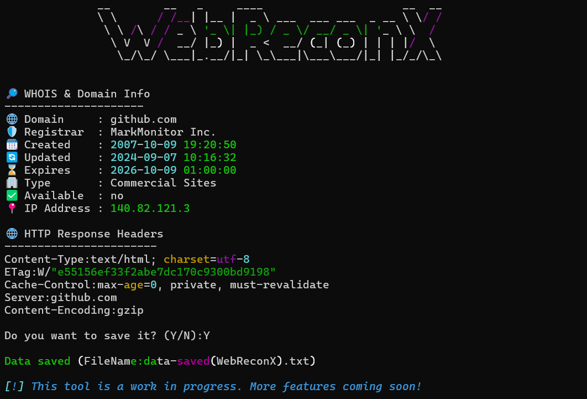

## WebReconX

**WebReconX** is a simple, legal, and shareable command-line Python tool for scanning website information including WHOIS data, IP address, HTTP headers, and more.

---

## 🚀 Features

- ✅ Fetches domain WHOIS info (registrar, created/updated/expires)
- 🌍 Resolves IP address from domain
- 📄 Shows key HTTP headers
- 🗺️ Reads sitemap.xml (if exists)
- 🤖 Parses robots.txt
- 👨‍💻 Displays humans.txt, ads.txt, and security.txt
- 💾 Saves a full report to a `.txt` file
- 🎨 Beautiful terminal output using `rich` and `pyfiglet`

---
## 🛠 Installation & Usage

1. Clone the repository:
<pre>
git clone https://github.com/ArwaBenh/WebReconX.git
</pre>
2.  Navigate to the project folder:
<pre>
cd WebReconX
</pre>
3.  Install required Python packages:
<pre>
pip install requests rich pyfiglet
</pre>
4.  Run the tool with a URL:
<pre>
python webreconx.py --url https://example.com
</pre>
Replace https://example.com with the website you want to scan.

---
## ✅ Requirements

* Python 3.7+
* `requests`
* `rich`
* `pyfiglet`
---
## 📂 Output

If enabled, results will be saved to: data-saved(WebReconX).txt
---
## ⚠️ Legal Disclaimer

This tool is intended for educational and authorized security research purposes only.
It collects only publicly accessible data (like robots.txt, security.txt, headers, etc.).

Don't use it on websites you don't own or don't have explicit permission to scan
---
## 📄 License

This project uses only public APIs and gathers public information legally. Please use responsibly.

---

